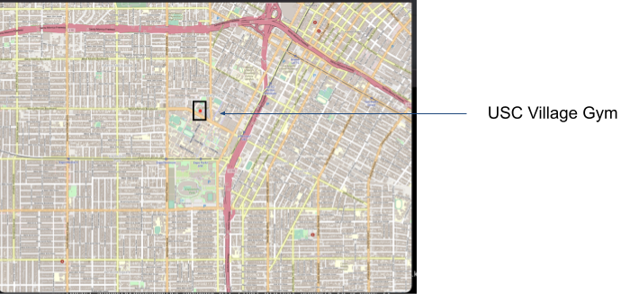
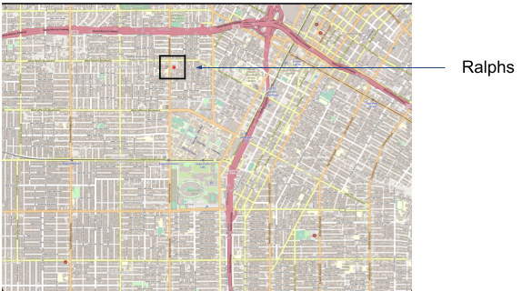
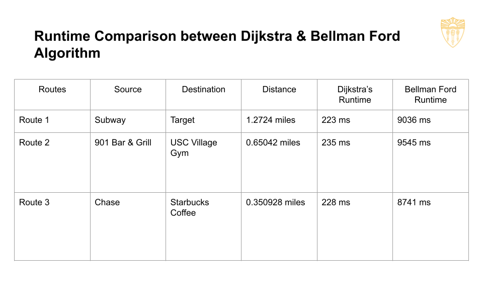
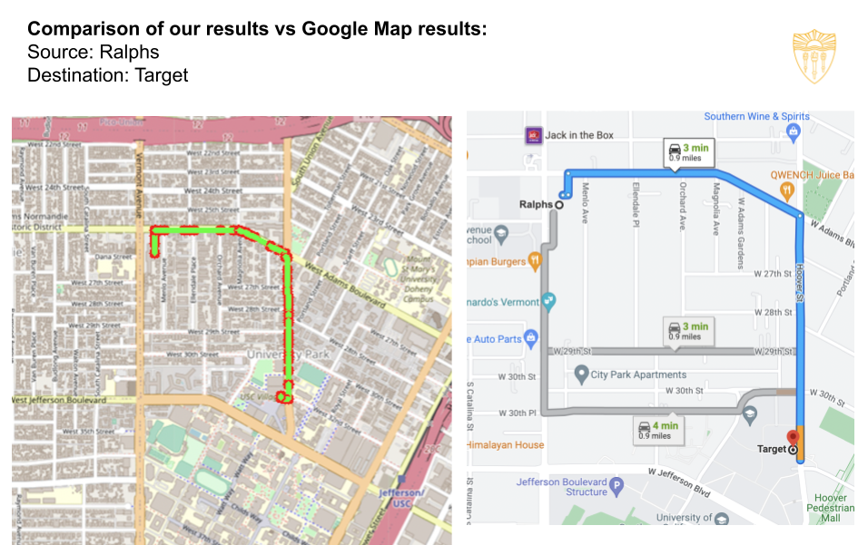
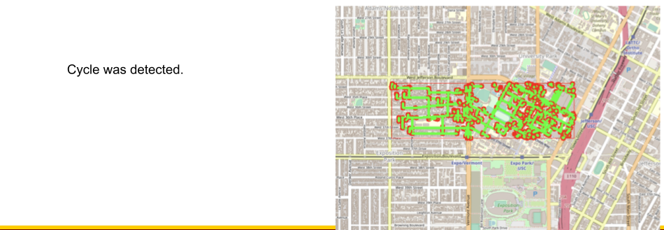
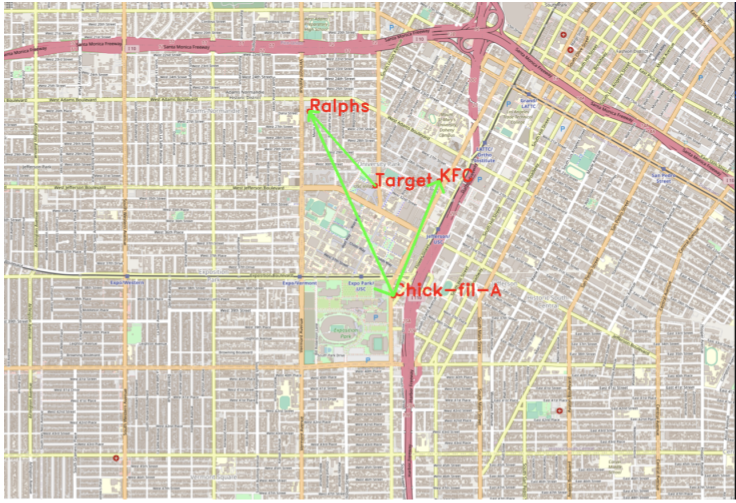
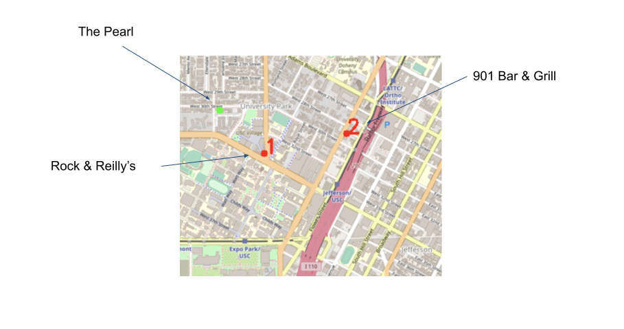

## EE538 Final Project Report - Spring 2022 - TrojanMap

Group Members:
1. Shoumik Nandi - (USC ID: 3621442772)
2. Shreeram Narayanan - (USC ID: 1937566881)

- PPT Link: https://docs.google.com/presentation/d/1W9Q-wUZbTN7Xb_kJssPn8NsrtjFMHLHL/edit#slide=id.p1

- Youtube Link: https://www.youtube.com/watch?v=zqmun2JQcdE

Phase 1 submission: Monday, April 11 by 23:59 pm

High-level overview of your design (Use diagrams and pictures for your data structures).
Detailed description of each function and its time complexity.
Time spent for each function.
Discussion, conclusion, and lessons learned.

1. Implementation of Auto complete: 5 points. (Phase 1)
2. Implementation of GetPosition: 5 points. (Phase 1)
3. Implementation of EditDistance: 10 points. (Phase 1)

## Step 1: Autocomplete the location name

- Design: 

We consider the names of nodes as the locations. Implement a method to type the partial name of the location and return a list of possible locations with partial name as prefix. We are expected to treat lowercase and uppercase characters as the same. We take the input as the partial name and are expected to return a vector of full names. For convenience of comparing we first convert the characters of the partial name to lowercase characters. We traverse through the list of names. While comparing with the partial names, at each iteration we convert the full names at the iteration to lowercase for convenience of comparison. We then do a letter/character by character comparison. If at a particular iteration a character of the partial name does not match the character of a full name,the partial name cannot be completed by that particular fullname and so then we go to the next iteration where the next name is compared. When all the characters of the fullname match the initial characters of the fullname, we can say that the full name can we used to autocomplete the partial name. As a result this fullname is added to the vector of possible fullnames for the partial name in its original for of casing of letters. Traversal takes place comparing all the fullnames with the partial names forming a vector of all possible fullnames. This vector is then outputed showing all the possibilities for the partial name. 

- Detailed description of each function and its time complexity

Let the length of the partial name be m,the number of fullnames be n, the length of the fullname be p. Accord to our logic, we convert the partial name to lowercase. This will take a time complexity of O(m).

Then we iterate through all the fullnames which will take a time complexity of O(n), at each iteration we will convert the name into lowercase which will take a time complexity of O(p). We then check if the length of the partial name is smaller than that of the fullname under consideration. We iterate through each character in the partial name comparing it with the corresponding character of the fullname under consideration. This will have a time complexity of O(m). If all the characters of the partial name match the corresponding characters of thre fullname, we add it to the list of possible fullnames. This entire loop will take a time complexity of O(mnp). Finally the list of possibl fullnames will be returned. Thus the time complexity of the Autocomplete function will be O(mnp).

- Time spent: 30 mins.

- Discussion, conclusion, and lessons learned

Thus we managed to write the autocomplete function in which we can find out as to what are the possible Fullnames if a partial name is entered.

## Step 2-1: Find the place's Coordinates in the Map

- Design: 

To implement the GetPosition function, we first implement GetID, GetLat and GetLon functions. The GetLat function will find the latitude given the ID of a particular location return the latitude value. Similarly, the GetLon function will find the longitude given the ID of a particular location and return the longitude value. The GetID function takes a location name as input and returns the ID corresponding to that location. In the implementation of GetPosition function which takes name as an input parameter, we first get the ID after calling GetID. After getting the ID, we then call the GetLat and GetLon functions to get the latitude and longitude values and store it in a pair. This function returns a pair with latitude and longitude values. 

- Detailed description of each function and its time complexity

In GetLat function, we used the find function for an unordered map which finds an element corresponding to a key and returns an iterator that points to it. This iterator was then used to access the ID of the unordered map and get the latitude value.

Time Complexity: O(n)

In GetLon function, we used the find function for an unordered map which finds an element corresponding to a key and returns an iterator that points to it. This iterator was then used to access the ID of the unordered map and get the longitude value.

Time Complexity: O(n)

In GetId function, we iterate through the elements of the unordered map data and if the name matches with the given input name, then we return the key corresponding to that element.

Time Complexity: O(n)

In GetPosition, we call GetId and get the Id of the given location name, we then use the find function of an unordered map and search for the ID, if it is not found we return (-1, -1). Once we get the ID of the particular location, we call GetLat and GetLon and return the latitude and longitude values in a pair.

Time Complexity: O(n)

- Time spent: 30 mins.

- Discussion, conclusion, and lessons learned

Thus we managed to write the GetPosition function in which we get the latitude and longitude values if the location name is passed as input to the function.

Fig.1 - Get Position Function Implementation Results

Fig.2 - Get Position Function Implementation Results (with incorrect user input)

## Step 2-2: Check edit distance between two location names

- Design: 

We have 2 inputs - The 2 location names between which we want to find the distance here are "a" and "b". For convenience of comparison we convert them to lowercase. We use Dynamic Programming approach to calculate edit distance betweenn 2 locations.

- Detailed description of each function and its time complexity

Firstly, we create a matrix d of size (length1 + 1) x (length2 + 1), where length1 = Size of first location name ("a"), length2 = Size of second location name ("b"). If we consider an element of d[i][j], we can say that d[i][j - 1] represents insertion, d[i - 1][j - 1] represents addition, d[i - 1][j - 1] represents replacement. The row 0 and column 0 are filled with the values of i and j respectively. These are the default base conditions. Respectively, if one of them were to be empty, then the value will be the value of the edit distance. The logic used is if 1 string is empty then the edit distance is the length of thre other string. To complete the matrix representing the edit distance between the 2 strings from partial strings right upto the complete strings, if the (i - 1)th character of the string "a" is the same as the (j - 1)th character of string "b", edit distance between the first (i - 1) characters of string "a" and (j - 1) characters of string "b" is the same as the (i - 1) characters of string "a" and (j - 1) of string "b". If the (i-1)th and (j-1)th characters of strings "a" and "b" respectively aren't the same, then we find the minimum of d[i - 1][j], d[i][j - 1] and d[i - 1][j - 1]. By finding the minimum, we find the minimum distance for the current characters under consideration. On completing the matrix, d[length1]d[length2] will give us the edit distance between the 2 strings.

Time Complexity: O(mn), where m = Length of String a, n = Length of string b.

- Time spent: 1 hr.

- Discussion, conclusion, and lessons learned

Thus, we implemented the CalculateEditDistance function which gives us the dit distance between 2 input strings where the 3 operations for edit involved are insertion, deletion and replacement.

## Step 2-2: FindClosestName

- Design: 

The FindClosestName function returns a string which is closest in terms of edit distance compared to the given input name entered by the user. This returned string is the closest name to the given name.

- Detailed description of each function and its time complexity

We set a variable minDist to INT_MAX. We iterate through every name in the unordered map and calculate the edit distance of the input name with every name in the map. The logic used is that if this distance is less than minDist we update minDist to the lower value. This is done till we reach the last element in the map. The name corresponding to the lowest edit distance is what is returned by the function as the closest name.'

Time Complexity: Let m be the length of the name entered and n be the length of the closest name. On entering the loop and comparing with all the possible names, The time complexity to convert the corresponding name entered into lowercase is O(m). Calculating the edit distance with each name to get the least distance is O(mn). Therefore the time complexity for FindClosestName is O(mnm).

- Time spent: 20 mins.

- Discussion, conclusion, and lessons learned

Thus, we implemented the FindClosestName function which gives us the closest name to the given input name based on the edit distance between the 2 strings.

Phase 2 submission: Wednesday, April 20 by 23:59 pm

Implementation of shortest path: 15 points. (Phase 2)
Bellman-Ford implementation
Dijkstra implementation
Plot two paths, and measure and report time spent by two algorithms.

Implement of Cycle detection: 10 points. (Phase 2)
Boolean value and draw the cycle if there exists one.

Topological Sort: 10 points. (Phase 2)
Check whether there exist a topological sort or not
Return the correct order and plot those point on the map

## Step 3: CalculateShortestPath between two places

## 1) Calculate Shortest Path using Dijkstra's Algorithm

- Design: 

The CalculateShortestPath_Dijkstra function returns the shortest path from a given location 1 (start node) to a location 2 (end node) based on Dijkstra's algorithm. The function returns vector of strings that has the id's of the locations through which we can get to the end node (shortest path).

- Detailed description of each function and its time complexity

This function takes 2 parameters location_name1 and location_name2 as input. We first get the closest name to the given input names to take care of the case where the input location entered by the user is erroneous/incorrect. 

The implementation of Dijkstra's algorithm is as follows:
 
1) We get the start and end nodes from location names using GetID function. If the start and end nodes entered are empty strings, we return an empty vector of string as the path.
2) We create a minheap using a priority queue.
3) We create an unordered map to save the shortest distances.
4) We also create an unordered map to save the predecessors of the current nodes.
5) We initialize the distance of start node from itself as 0 and the distance of other nodes from the start node as infinity.
6) We run this algorithm till the minheap is empty and thus initiate a while loop for the same. In this loop, We get the shortest distance node which is the top element of the minheap.
7) Check if current node is the end node, if not we check if the shortest distance is greater than the current node's shortest distance in the map. If yes, we continue. If not, we traverse through the neighbors of the current node and check the distance of each neighbor node with the previous node. If distance of the previous one is greater than each neighbor node's shortest distance, we update the shortest distance map and the predecessor map. We push this pair in the minheap.
8) Now we append to the path vector from the end and reverse the vector to get the shortest path from start node to the end node.

Time Complexity: O(ElogV)
      E is the number of edges in the graph.
      V is the number of vertices in the graph.

- Discussion, conclusion, and lessons learned

Thus, we successfully implemented the CalculateShortestPath_Dijkstra algorithm which gives us the shortes path from a starting location to the destination location.

## 2) Calculate Shortest Path using Bellman Ford Algorithm

- Design: 

The CalculateShortestPath_Bellman_Ford function returns the shortest path from a given location 1 (start node) to a location 2 (end node) based on Bellman Ford's algorithm. The function returns vector of strings that has the id's of the locations through which we can get to the end node (shortest path).

- Detailed description of each function and its time complexity

This function takes 2 parameters location_name1 and location_name2 as input. We first get the closest name to the given input names to take care of the case where the input location entered by the user is erroneous/incorrect. 

The implementation of Bellman Ford's algorithm is as follows:

1) We get the start and end nodes from location names using GetID function. If the start and end nodes entered are empty strings, we return an empty vector of string as the path. If start and end nodes entered by the user are empty strings we return an empty vector.
2) We create an unordered map to store the shortest distance for each node,.
3) We the create an unordered map to store the predecessors of each node to build the path.
4) We set a boolean stop sign as true and traverse through all of the edges.
5) We set the distance of the start node with itself as 0 and the distance of other nodes from the start node as infinity in the shortest distance map.
6) We run a loop i-1 times (that is for considering atmost 1 edge, 2 edge and so on until N-1 edges). We traverse every element in the shortest distance map and also traverse through every neighbor of the current node, we now check if each neighbor node's distance is lesser than the previous one's distance or not. If yes, we update the current shortest distance in the shortest distance map and also update the predecessor map. We now set the stop sign to false.
7) If the stop sign is true, we break else we continue to traverse through the new data map again.
8) We then build the path from the predecessor map.
9) This is an early termination based implementation of the Bellman-Ford Algorithm.

Time Complexity: O(V * E)
where V is the number of vertices in the graph
      E is the number of edges in the graph

- Discussion, conclusion, and lessons learned

Thus, we successfully implemented the CalculateShortestPath_Dijkstra algorithm which gives us the shortes path from a starting location to the destination location.

- Comparison between the shortest path algorithms Dijkstra and Bellman Ford:

1) The 2 shortest path algorithms were run for 3 different example test cases.
2) The time complexities for each of the algorithms are:

a) Dijkstra: O(ElogV)
b) Bellman Ford: O(V * E)

From this we can conclude that, Dijkstra is faster than Bellman Ford significantly

This can also be proven by comparing the runtime for both of these algorithms.

3) The time taken for each of the algorithms are:

Route: Subway(Source) to Target (Destination)
a) Dijkstra: 223 ms
b) Bellman Ford: 9036 ms

Fig.3 - Runtime Comparison between Dijkstra's and Bellman Ford Algorithm

Fig.4 - Comparison of our Results vs Google Maps Results

## Step 4: Travelling Salesman Problem

- Design: 

This function returns the shortest route that one can take from the first point being the starting point given the location ids of various locations. This was implemented using 3 approaches namely,
1) Brute Force
2) Backtracking
3) 2-opt

- Detailed description of each function and its time complexity:

1) Brute Force: 

- In this approach, we evaluate all the possible routes and then find the minimum among them, that would be our most feasible route. We find all possible paths using DFS and find the shortest path out of those paths.

2) Backtracking:

- In this approach, we start building the routes incrementally and we abandon a candidate/route if cannot contribute to a possible valid solution. Thus, in this approach we create a tree of the possible routes and reject and accept based on who will contribute to a possible solution. This has a minor change as compared to the Brute Force approach. If the distance is exceeded, then we automatically look into the next possible path.

3) 2-opt:

- The 2-opt approach is similar to the Brute Force one just that we don't use permutations. Instead of using permutations, we use two for loops to obtain a sub part in location ids vector and reverse this sub part. If the updated vector’s path length is smaller, we update like what we did in Brute Force and go back to start again. This is an algorithm where swapping mechanism works as heuristic.

Time Complexity: 

1) Brute Force: O(n!) 
2) Backtracking: O(n!)
3) 2-opt: O(n^2)

- Discussion, conclusion, and lessons learned

Thus, we implemented the Travelling salesman function to get the shortest route given a set of locations.

## Step 5: Cycle Detection

- Design: 

This function checks if given a graph as input, does the graph have a cycle present in it or not. It returns a boolean value of whether a cycle is present in the graph or not.

- Detailed description of each function and its time complexity

CycleDetection Function Implementation:
1) We define an unordered map visited and a predecessors map. We traverse through

CycleHelper Function Implementation:
1) We first run DFS on the graph starting from each node and check if a back edge is found or not. If it is found, we understand that the graph contains a cycle.
2) We now implement the CycleHelper function, we first mark the current node as visited.
3) Traverse through each of the neighbors of the current node, we also have to check if the graph exists in the square using InSquare function. If the neighbor is not visited, we call the CycleHelper function recursively, if it is true, there is a cycle in the graph and we return true from the function.
4) If not, we check if the neighbor is equal to the parent id, if yes a back edge is found and the graph has a cycle present in it.
5) Otherwise, no cycle is found and we return false.

Time Complexity: O(V+E)
where V is the number of vertices in the graph
      E id the numbe of edges in the graph

- Discussion, conclusion, and lessons learned

Thus, we successfully implemented the cycle detection function to check if a cycle is present in a graph or not.

Fig.5 - Cycle Detection Implementation Results

Fig.6 - Cycle Detection Implementation Results

## Step 6: Topological Sort

- Design: 

This function takes as input the location names to visit and also some dependencies between these locations, it returns a vector of strings which give us the topological sort order in which the locations have to be visited.

- Detailed description of each function and its time complexity

Before running DFS, we construct a Directed Acyclic Graph (DAG) and then implement the topological sort algorithm to get the best route.

1) Run DFS from one node and add it to the result vector once we finish visiting all the children of a node.
2) Then we run DFS from another unvisited node and update our result vector.
3) By reversing the result vector, we get a valid topological sort and return this result vector.

Time Complexity: O(V+E)
where V is the number of vertices in the graph
      E is the number of edges in the graph

- Discussion, conclusion, and lessons learned

Thus, we successfully implemented the topological sort functionto get the order in which the locations have to be visited based on the dependencies.

Fig.7 - Topological Sort Implementation Results

## Step 6: Find Nearby

- Design: 

This function gives us the k nearest locations given the attribute name, location name, a range r and an integer k. The order of locations is from nearest to farthest.

- Detailed description of each function and its time complexity

We traverse through the locations which have the specified attribute and use a min heap using priority queue to implement this function.

Time Complexity: O(n * log(n))

- Discussion, conclusion, and lessons learned

Thus, we implemented the FindNearby function to get the k nearest locations given parameters like location name, attribute and range.

Fig.8 - Find Nearby Implementation Results

